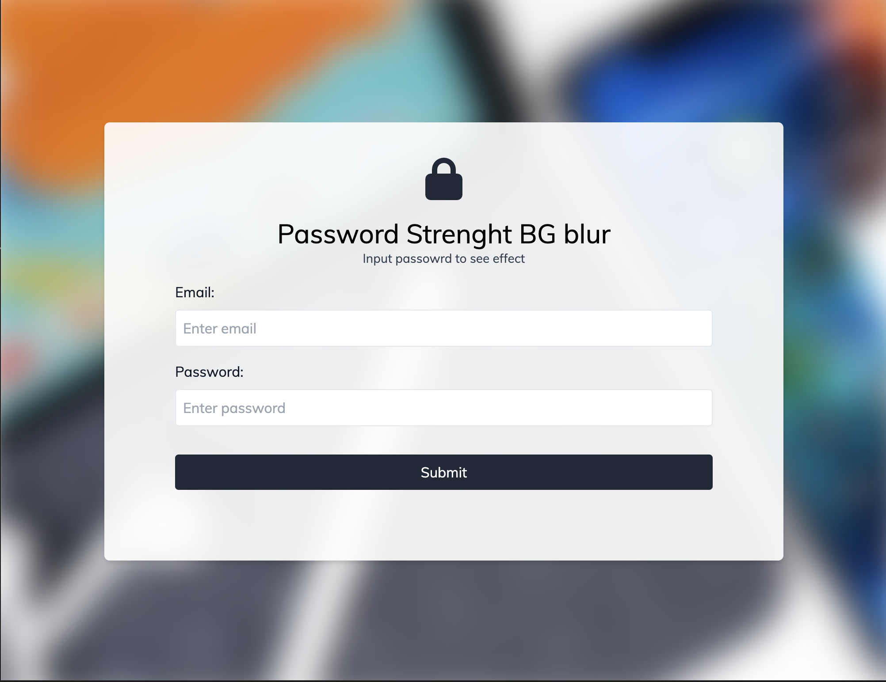

# Password Strength x Background Blur



A creative and interactive web application that visually represents password strength using a dynamic background blur effect. Built with HTML, CSS, and JavaScript, this project demonstrates how to provide real-time feedback to users in an engaging and intuitive way. The stronger the password, the clearer the background becomes!

## Key Features
- **Dynamic Background Blur**: The blur effect decreases as the password length increases, providing real-time feedback.
- **Interactive Design**: Input fields for email and password with a visually appealing, user-friendly interface.
- **Responsive UI**: Works seamlessly across all device sizes.
- **Modern Aesthetic**: Styled with TailwindCSS and custom CSS for a polished, modern look.

## Technologies Used
- **Frontend**: HTML, CSS (with TailwindCSS integration).
- **JavaScript**: Handles dynamic blur effect and real-time password strength indication.

## How to Run
1. Clone the repository:
   ```bash
   git clone https://github.com/yourusername/password-strength-bg-blur.git
   cd password-strength-bg-blur
   ```
2. Open `index.html` in your browser to see the project in action.

## Live Demo
Check out the live [demo](https://chrisroland.github.io/Password-Strengths-x-BG-blur/)

## Future Enhancements
- Add a password strength meter for a more comprehensive evaluation.
- Incorporate guidelines for strong password creation.
- Support additional visual effects, such as color changes or animations.
- Implement accessibility improvements.

## Contributions
- Feel free to **open issues** if you encounter bugs or have suggestions for improvement.
- **Pull requests** are welcome for new features or refinements.
- This project is **open-sourced**, and I encourage **constructive feedback** and **collaborations**!

Thank you! ❤️